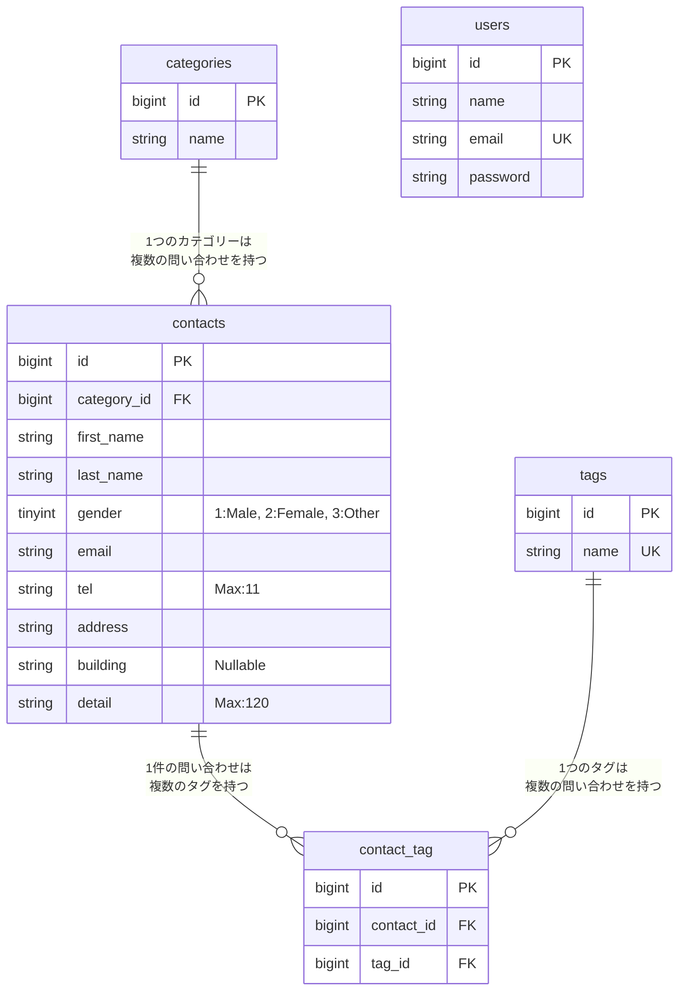

```mermaid
erDiagram
    categories ||--o{ contacts : "1つのカテゴリーは<br>複数の問い合わせを持つ"
    contacts ||--o{ contact_tag : "1件の問い合わせは<br>複数のタグを持つ"
    tags ||--o{ contact_tag : "1つのタグは<br>複数の問い合わせを持つ"

    categories {
        bigint id PK
        string name
    }

    contacts {
        bigint id PK
        bigint category_id FK
        string first_name
        string last_name
        tinyint gender "1:Male, 2:Female, 3:Other"
        string email
        string tel "Max:11"
        string address
        string building "Nullable"
        string detail "Max:120"
    }

    tags {
        bigint id PK
        string name UK
    }

    contact_tag {
        bigint id PK
        bigint contact_id FK
        bigint tag_id FK
    }

    users {
        bigint id PK
        string name
        string email UK
        string password
    }
```
