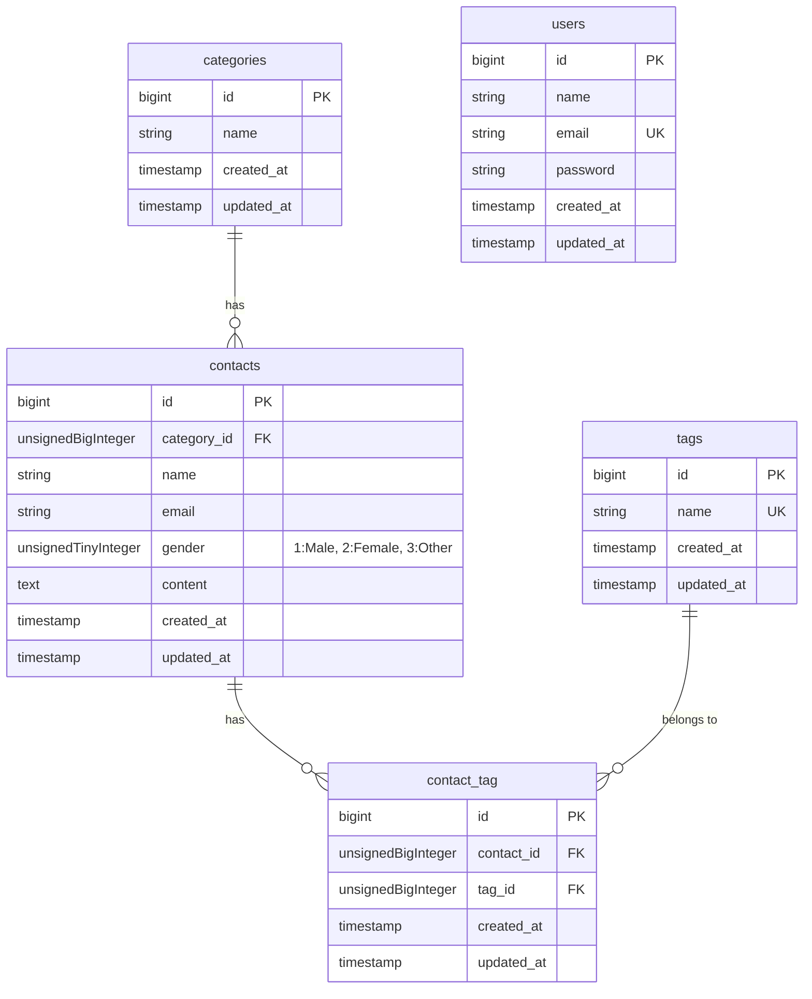

```mermaid
erDiagram
    categories ||--o{ contacts : "has"
    contacts ||--o{ contact_tag : "has"
    tags ||--o{ contact_tag : "belongs to"

    categories {
        bigint id PK
        string name
        timestamp created_at
        timestamp updated_at
    }

    contacts {
        bigint id PK
        unsignedBigInteger category_id FK
        string name
        string email
        unsignedTinyInteger gender "1:Male, 2:Female, 3:Other"
        text content
        timestamp created_at
        timestamp updated_at
    }

    tags {
        bigint id PK
        string name UK
        timestamp created_at
        timestamp updated_at
    }

    contact_tag {
        bigint id PK
        unsignedBigInteger contact_id FK
        unsignedBigInteger tag_id FK
        timestamp created_at
        timestamp updated_at
    }

    users {
        bigint id PK
        string name
        string email UK
        string password
        timestamp created_at
        timestamp updated_at
    }
```
