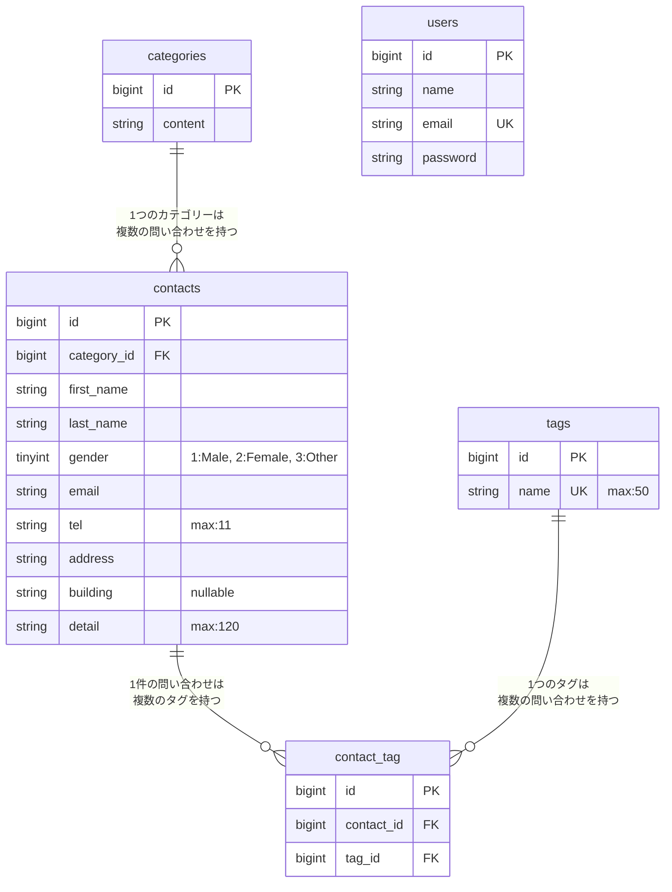

# COACHTECH_確認テスト お問い合わせフォーム

## 概要
- 目的：要件を満たすお問い合わせフォームアプリケーションの作成を行いました（フロントエンドはbladeテンプレートが提供されているため、バックエンドの作成のみです）

- 実装機能の概要
    - ブラウザでのお問い合わせフォームの表示、新規登録
    - 管理者画面でのお問い合わせ一覧の表示（絞り込みあり）、CSVエクスポート、詳細取得、削除（認証あり）
    - 管理者画面でのタグのCRUD機能（認証あり）
    - 公開APIによるお問い合わせのCRUD機能

## データテーブルのER図



## 環境構築手順

1. Laravelプロジェクトの作成 (Laravel 10.x)

```
注意: curl -s "https://laravel.build/..." は最新版のLaravelをインストールするため、今回は使用しません。

以下のDockerコマンドを実行して、Laravel 10.xを明示的に指定してプロジェクトを作成します。

# Laravel 10.x を指定してプロジェクトを作成
docker run --rm \
    -u "$(id -u):$(id -g)" \
    -v "$(pwd):/var/www/html" \
    -w /var/www/html \
    -e COMPOSER_CACHE_DIR=/tmp/composer_cache \
    laravelsail/php82-composer:latest \
    composer create-project laravel/laravel:^10.0 contact-form-app
```

2. Laravel Sailのインストール

```
プロジェクト作成後、contact-form-app ディレクトリに移動し、Laravel Sailをインストールします。

# プロジェクトディレクトリに移動
cd contact-form-app

# Laravel Sailをインストール
docker run --rm \
    -u "$(id -u):$(id -g)" \
    -v "$(pwd):/var/www/html" \
    -w /var/www/html \
    -e COMPOSER_CACHE_DIR=/tmp/composer_cache \
    laravelsail/php82-composer:latest \
    composer require laravel/sail --dev

# Sailの設定ファイルをパブリッシュ（MySQLを選択）
docker run --rm \
    -u "$(id -u):$(id -g)" \
    -v "$(pwd):/var/www/html" \
    -w /var/www/html \
    -e COMPOSER_CACHE_DIR=/tmp/composer_cache \
    laravelsail/php82-composer:latest \
    php artisan sail:install --with=mysql

# ※M1/M2/M3 Mac（Apple Silicon）をお使いの方

Apple Silicon搭載のMacでは、`sail up -d`実行時に以下のエラーが発生することがあります：

```
no matching manifest for linux/arm64/v8
```

解決方法: `compose.yaml`を開き、mysqlサービスに`platform: 'linux/amd64'`を追加してください。
mysql:
    image: 'mysql/mysql-server:8.0'
    platform: 'linux/amd64'  # ← この行を追加
    ports:
```

3. .env ファイルの設定

```
.env ファイルを開き、データベース接続情報が以下と一致していることを確認します。

DB_CONNECTION=mysql
DB_HOST=mysql
DB_PORT=3306
DB_DATABASE=laravel
DB_USERNAME=sail
DB_PASSWORD=password

重要: DB_HOST は localhost や 127.0.0.1 ではなく、Dockerコンテナ名である mysql を指定します。
```

4. フロントエンドのセットアップ (Vite & Tailwind CSS)

```
本プロジェクトでは、フロントエンドのスタイリングにTailwind CSSを使用します。

1. NPM依存パッケージのインストール
> 重要: sail npm install を実行する前に、必ずSailコンテナが起動していることを確認してください。
sail npm install

2. Tailwind CSSのインストール
sail npm install -D tailwindcss@^3.4.0 postcss autoprefixer
sail npm install alpinejs

3. 設定ファイルの生成
sail npx tailwindcss init -p

4. Tailwind CSSのテンプレートパス設定
tailwind.config.js を開き、以下のように設定します。
/** @type {import("tailwindcss").Config} */
export default {
  content: [
    "./resources/**/*.blade.php",
    "./resources/**/*.js",
    "./resources/**/*.vue",
  ],
  theme: {
    extend: {},
  },
  plugins: [],
}

5. 提供リポジトリのresourcesディレクトリと入れ替え
以下のリポジトリをクローンし、resourcesディレクトリを丸ごと入れ替えます。
git clone https://github.com/coachtech-prepared-file/Preparedblade-ConfirmationTest-ContactForm.git

入れ替え手順:
① Finderでプロジェクトフォルダを開きます。
open .
② プロジェクト内の resources フォルダを削除します。
③ クローンしたリポジトリ内の resources フォルダをプロジェクト直下にコピーします。

※コマンド操作に慣れている場合は rm -rf と cp -r でも可能ですが、誤削除を防ぐためFinderでの操作を推奨します。

6. Vite開発サーバーの起動
sail npm run dev
注意: sail npm run dev は実行したままにしておく必要があります。
```

5. phpMyAdminの追加

```
compose.yaml を開き、mysql サービスの後に以下の設定を追加してください。

compose.yaml に追加する内容:

    phpmyadmin:
        image: 'phpmyadmin:latest'
        ports:
            - '${FORWARD_PHPMYADMIN_PORT:-8080}:80'
        environment:
            PMA_HOST: mysql
            PMA_USER: '${DB_USERNAME}'
            PMA_PASSWORD: '${DB_PASSWORD}'
        networks:
            - sail
        depends_on:
            - mysql
```

6. Sailの起動とエイリアス設定

```
# Sailをバックグラウンドで起動
./vendor/bin/sail up -d

# エイリアスを設定して 'sail' だけでコマンドを実行できるようにする
echo "alias sail='[ -f sail ] && bash sail || bash vendor/bin/sail'" >> ~/.zshrc

# または bash の場合
# echo "alias sail='[ -f sail ] && bash sail || bash vendor/bin/sail'" >> ~/.bashrc

# シェルを再起動するか、新しいターミナルを開いてエイリアスを有効にする
exec $SHELL
```

7. アプリケーションキーの生成
```
ルートで以下のコマンドを実行する
sail artisan key:generate
```

8. データベースのマイグレーションと初期データ投入
```
以下のコマンドでテーブルを作成し、初期データを投入します。
sail artisan migrate --seed

※既存のデータベースをリセットしたい場合は以下を実行してください。
sail artisan migrate:fresh --seed

⚠️  日本語化／翻訳について:
— 日本語化は FormRequest の `messages()` と `lang/ja`（認証系）で行います。
`laravel-lang/*` 系の外部翻訳パッケージ（`composer require laravel-lang/...`）は導入しないでください。
同系パッケージは 2026年5月のサプライチェーン攻撃でマルウェア配布に悪用された経緯があり、本課題では不要です。
```

## 使用技術

- バックエンド: PHP 8.1 / Laravel 10.10
- データベース: MySQL 8.4
- テスト: PHPUnit
- 環境構築: Docker / Laravel Sail
- DB管理ツール: phpMyAdmin (`http://localhost:8080`)
- APIテスト: Postman

## APIエンドポイント一覧
- **GET** `/api/v1/contacts` : お問い合わせ一覧の取得
  - クエリパラメータによる絞り込みが可能（`keyword`, `gender`, `category_id`, `date`）
  - ページネーション対応（`per_page`: デフォルト20件、`page`: ページ番号指定）
- **GET** `/api/v1/contacts/{contact}` : お問い合わせ詳細の取得
- **POST** `/api/v1/contacts` : お問い合わせの新規作成（JSON 形式でリクエスト）
- **PUT** `/api/v1/contacts/{contact}` : お問い合わせの更新（JSON 形式でリクエスト）
- **DELETE** `/api/v1/contacts/{contact}` : お問い合わせの削除（成功時 `204 No Content`）

## 開発環境URL

` http://localhost `

## 作成者

- 久光 和輝（ヒサミツ カズキ）
